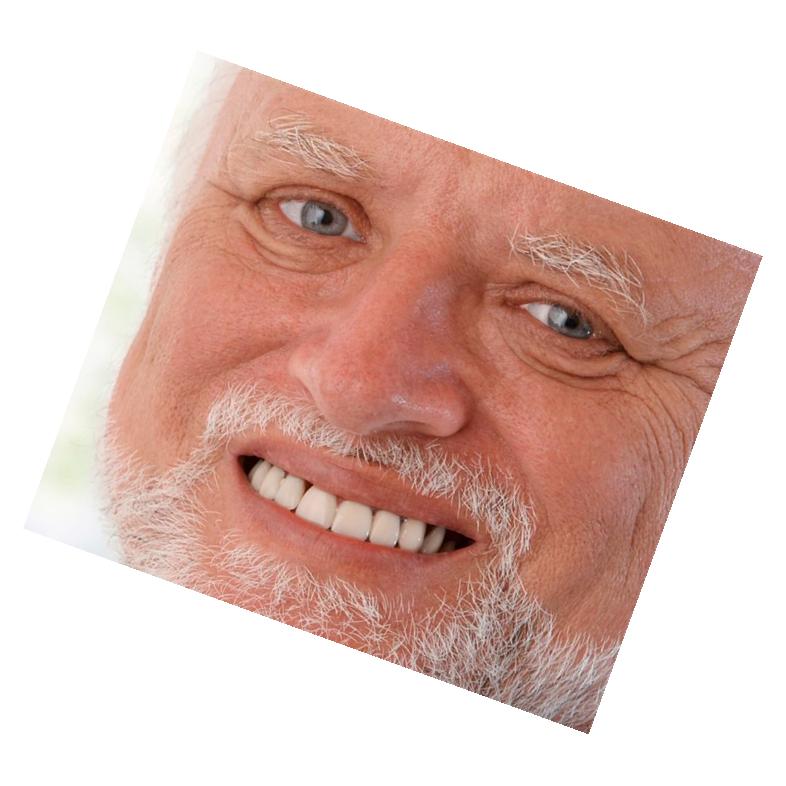

# Image rotation

## Approach
Image rotation is pretty straightforward. All we have to do is to map resulting screen space to the original image space using
an inverted rotation matrix. Basically, we can use homogenous (affine) transform instead of the rotation matrix and get a
universal "transform" tool, akin to GIMP's or Photoshop's one.
We make a few assumptions regarding the task. First, we don't bother cropping the resulting canvas. This is not difficult, but
its easier this way. We will bother to capture the entire image, without clipping, though. Second, we won't optimize the solution.
There's an whole universe of things we might have done for it, depending on the application. Lastly, no AA of the edges.

I used a ShaderToy to prototype the transform, then implemented it along with a few interpolation options (None, Nearest and Bilinear).

## Results





## Interpolation

Two basic flavours: nearest and bilinear. Here's the comparison (leftmost - bilinear, rightmost - nearest).


## Latency
For Harold (600x507) pic its:
```
Nearest time: 21 ms. 543 us.
Bilinear time: 16 ms. 780 us.
```

For Spinning thingy (860x900) pic its:
```
Nearest time: 52 ms. 568 us.
Bilinear time: 41 ms. 900 us.
```

Pretty lame, of course, but good enough for now. It's about 20-40 FPS, but for high res images an animation wouldn't look smooth in real-time.
