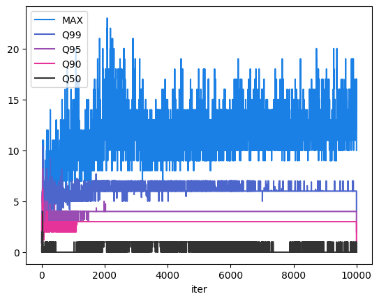
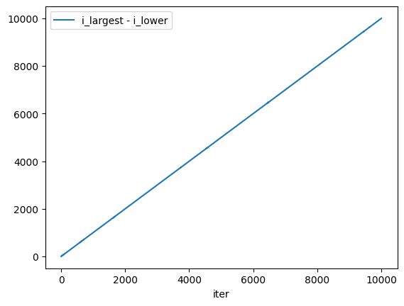
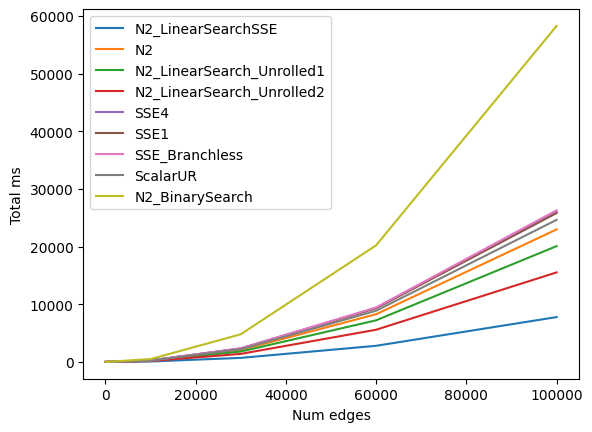
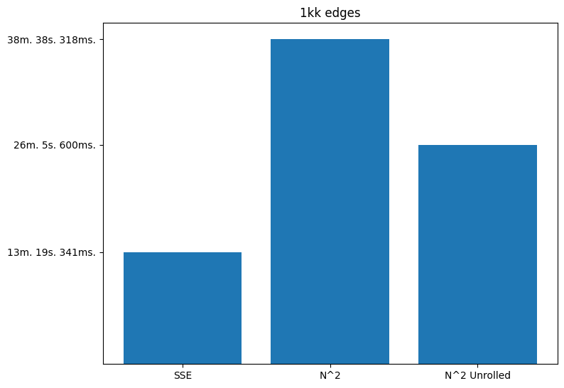

# Triangle counter

## Problem
We have an array of integer numbers. Each number represents an edge i.e. its length.
Count the number of triangles which may be constructed using these edges.
Throughout this text, we assume the input array is sorted.

### Test
A triangle with edge lengths `a <= b <= c` is valid (non-degenerate), iff `a + b < c`.

### CPU
Quad-core (8 vCPUs) 11th Gen Intel(R) Core(TM) i7-1185G7 @ 3.00GHz

## Baseline approaches

### `O(N^3)`
A naive way to count the triangles is a brute force. We iterate over all possible
triplets in 3 loops and increment a counter every time a triplet is valid.

```cpp
size_t N = edges.size();
int64_t num_tri = 0;
for (size_t i = 0; i < N - 2; ++i) {
    for (size_t j = i + 1; j < N - 1; ++j) {
        for (size_t k = j + 1; k < N; ++k) {
            if (edges[i] + edges[j] > edges[k]) {
                ++num_tri;
            }
        }
    }
}
```

### `O(N^2)`
After a while I came up with a better way. We pick a largest edge. Next, we pick a second
largest edge, top to bottom. Next, we pick the smallest third edge such that the resulting
triplet resembles a valid triangle. All other (larger) choices of the third edge are also valid,
so it does not make sense to test those. Therefore, we increment the counter by the number of those
choices and proceed with the computation.

```cpp
size_t N = edges.size();
int64_t num_tri = 0;
for (size_t i_largest = 2; i_largest < N; ++i_largest) {

    size_t i_lower = 0;
    size_t i_upper = i_largest - 1;

    while (i_lower < i_upper) {
        if (edges[i_lower] + edges[i_upper] > edges[i_largest]) {
            num_tri += i_upper - i_lower;
            --i_upper;
        } else {
            ++i_lower;
        }
    }
}
```

Of course, this is a significant improvement over the `O(N^3)` algorithm. However, it would take
about a half an hour to process a million numbers. This time, I'll try to squeeze a few extra
bits of performance.

Results (will be used as a baseline):
```
Running CountTri_N2
Num triangles: 82851985353289
Time: 0 m. 23 s. 728 ms. 77 us.
```
I won't provide `O(N^3)` results here, as it takes forever to finish.

## First attempt

First, I wasted some time doing "vertical" SIMD optimizations. I recognized, that in the inner loop
we essentially perform a linear search of the first third edge.

```cpp
for (size_t i_largest = 2; i_largest < N; ++i_largest) {
    size_t i_lower = 0;
    size_t i_upper = i_largest - 1;

    if (edges[i_upper - 1] + edges[i_upper] <= edges[i_largest]) continue;

    while (i_lower < i_upper) {
        i_lower = LinearSearch(edges, i_lower, i_upper, edges[i_largest] - edges[i_upper]);
        num_tri += i_upper - i_lower;
        --i_upper;
    }
}
```

Naturally, I tried to speed this search up. I whipped up a few quick SSE implementations
(see `sse_v0.cc`). One of the main problems is that the slice we look through does not always
start from an 16-byte aligned address. This means that we either have to copy the memory into a
register by performing an unaligned load, or process unaligned elements in the beginning and
the end of a slice using scalar code.
Not that unaligned loads induce large penalties on x86, but having to copy bytes from memory to
a register isn't great.

Also `perf stat` revealed a horrible amount of branch miss predictions, so a few solutions were attempts to
use branchless code.

These attempts did not give a measurable performance boost. I also tried using a binary search, but
it was even worse.

At this point, as usual, I begin to study the problem.

## Second attempt

First, I decided to gather some stats about the searches. I was particularly interested in a typical search space
sizes and typical indices of resulting elements. You may find some analysis in `Analysis.ipynb`.



Oh, nuts. I've been trying to vectorize searches which typically terminate within a few first steps. Of course,
binary searches, no matter how branchless, would be way slower.

This may be useful though! If about 90+% of searches terminate after the first few steps, it may be beneficial to
unroll the first few iterations of the search loop. This way, we may be able to exploit the CPU's pipeline and
to avoid a single index check in the beginning of a for-loop.

```cpp
ssize_t res = -1;
#define STEP(i) if (arr[i_lower + i] > ref) res = i_lower + i
STEP(3);
STEP(2);
STEP(1);
STEP(0);
#undef STEP

if (res >= 0) return std::min((size_t)res, i_upper);
```

Boom. Now we're talking.
```
Running CountTri_N2_LinearSearch_Unrolled1
Num triangles: 82851985353289
Time: 0 m. 19 s. 995 ms. 542 us.
```

Now, let's make it branchless. Basically, the trick was stolen from _this_ article. It's easy - you just
increment an index of the result whenever a value is lower than our key.

```cpp
for (size_t i = i_lower; i < i_upper; ++i) {
    i_result += arr[i] <= ref;
}
return i_result;
```

With this technique, our code becomes as following.
```cpp
size_t res = 0;
#define STEP(i) res += arr[i_lower + i] <= ref
STEP(3);
STEP(2);
STEP(1);
STEP(0);
#undef STEP

if (res < 4) return std::min(i_upper, res + i_lower);
```

And again, we get a decent boost.
```
Running CountTri_N2_LinearSearch_Unrolled2
Num triangles: 82851985353289
Time: 0 m. 15 s. 330 ms. 760 us.
```

I tried to tune the number of unrolling steps and replacing them with SSE code. Did not work well.
I think this is the evidence, that our benefit comes from exploiting the pipeline.

## Going bananas

Fine so far, but we want more. The fact that the sizes of search spaces increase linearly with
the iterations (see the plot) suggests that we *can* go much faster. I genuinely hope so.



This can be done with SSE. All we have to figure out is how to process multiple inner loop iterations
independently. Turns out, it's possible. See `sse_v1.cc` for details. The code is a bit messy, but
there are only a few tricky points.

First, we perform 4 independent searches - one for each "second largest" edge.

Second, we also unroll a few first iterations and fall back to the SSE linear search if necessary.

Third, the result of each search does not change if `i_lower` is decreased, or if `i_upper` is increased,
assuming our search is performed in a "branchless" way.

We set `i_lower` to the result of the lowest "second largest" edge SSE line.
```cpp
i_lower = _mm_extract_epi32(new_i_lowers, 0);
```

We use two registers with two 64-bit numbers as counters. Otherwise, we get wrong results when the numbers
go high due to the overflows.
```cpp
__m128i a = _mm_cvtepu32_epi64(new_tris);
__m128i b = _mm_cvtepu32_epi64(_mm_shuffle_epi32(new_tris, _MM_SHUFFLE(0, 1, 2, 3)));
num_tri0 = _mm_add_epi64(num_tri0, a);
num_tri1 = _mm_add_epi64(num_tri1, b);
```

Here are the results:
```
Running CountTri_N2_LinearSearchSSE
Num triangles: 82851985353289
Time: 0 m. 7 s. 886 ms. 868 us.

```

Now, we are talking. Let's plot the results of all the experiments.


## Multi-Threading
Of course, this algorithm is embarrassingly parallelized. We can spawn a few threads, each would process a
separate choice of the largest edge. I won't rely on that too much, but I'll use that for processing a
million edges. I was too lazy for thread pools and stuff, so I used OpenMP's pragmas instead.

## Processing a million edges

Counting valid triangles for million possible edges takes a while, so I won't include all the solutions.
Love the number `83359211353608282`, though.


P.S. As promised, I enabled OpenMP. With it, we're able to process 1kk edges in about 3 minutes
with our best method.

### What else?

Well, there's AVX and AVX512, potentially giving us up to 4x speed up. I chose SSE, because it looks
more like NEON which is more familiar to me.

SSE implementation is not perfect. I did not spend a lot
of time picking better instructions or tuning unrolling there. For instance `perf` reports that
"min" instruction is hot (11% or something) and I believe it can be avoided one way or another.

Data structures are not explored at all. I did not find cache misses to be a bugger here, but
we may find some other exploitable patterns.

Lastly, we can go in GPU land, which sounds super fun.
